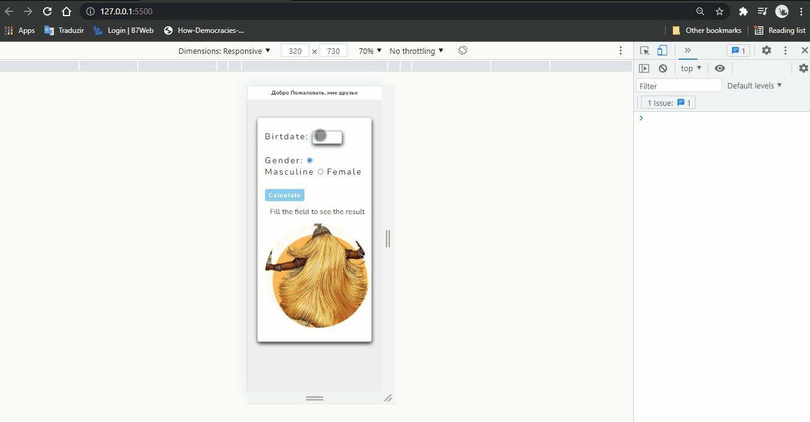

<h1>A calculator of ages based on the current year</h1>

 I took this with <a href="https://www.youtube.com/watch?v=f5es-PpaUI8&t=1161s">Curso em Vídeo</a> a channel on Youtube, but I change a lot of things, images, fonts, colors, and others even the code is different, I took in my way based on that.

 The project is rather simple but it's great to practice and don't forget the concepts of date and attributes. I will put a gif testing out this.

